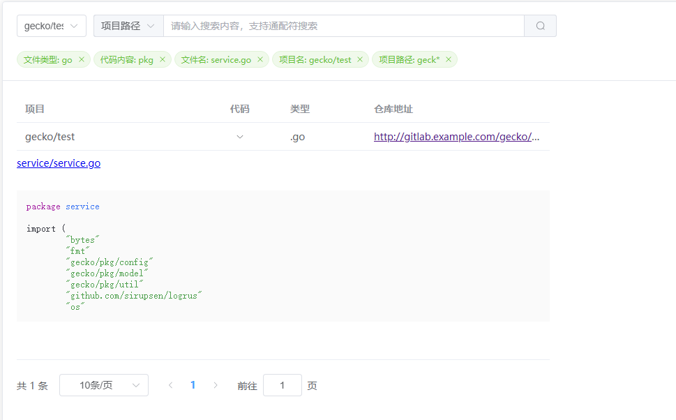

# Gecko 后端

## 项目介绍

Gecko 是一个代码搜索项目，支持搜索 Gitlab 项目仓库代码



- 支持代码片段预览
- 支持根据项目搜索
- 支持 Gitlab Oauth 登录

## 部署

### 准备环境

- Nginx
- Docker
- Gitlab(API v4)
- Elasticsearch 7

### 配置文件

`cp config/config-example.yaml config/config.yaml`

#### Oauth 配置

1. https://gitlab.example.com/admin/applications
2. 回调 URL: https://gecko.example.com/oauth/callback
3. 勾上 `read_user` 权限

### Nginx

```shell
server {
    listen       0.0.0.0:8080;
    server_name  <http_host>;
    # 前端编译后的静态文件
    location / {
	    root /data/gecko-web/dist;
            try_files $uri $uri/ /index.html;
    }
    # 后端接口
    location /api {
        proxy_pass http://192.168.1.1:8080;
    }
}
```

### 后端

```shell
docker build -f build/Dockerfile -t gecko .
docker run -d \
--name gecko \
-p 8080:8080 \
-v /data/gecko:/data/gecko \
--restart unless-stopped gecko
```

### 前端

https://github.com/sanmuyan/gecko-web


